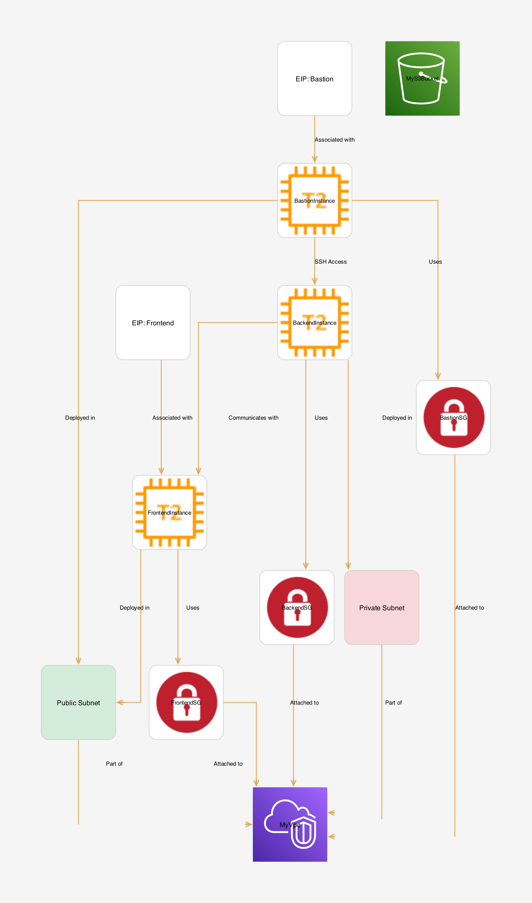

# **AWS Infrastructure Provisioning with CDK and Python**

## 🚀 Project Overview
This repository demonstrates how to provision robust AWS infrastructure using **AWS Cloud Development Kit (CDK)** and **Python**. The infrastructure includes:

## Project Structure

This structure helps organize the project files and ensures a clear separation of concerns, making the codebase more maintainable and easier to navigate.
```
.
├── README.md                 # Documentation
├── app.py                    # Application entry point
├── architecture-diagram.png  # Infratructure Diagram
├── cdk.json                  # CDK configuration file
├── cdk.out                   # Output directory for CloudFormation templates
├── constants.py              # Shared constants used throughout the project
├── diagram.dot               # Source file for the architecture diagram
├── requirements-dev.txt      # Development dependencies
├── requirements.txt          # Production dependencies
├── source.bat                # Batch file to activate the virtual environment
├── tests                     # Unit tests for the project
│   ├── **init**.py           # Python package initialization
│   └── unit                  # Unit test cases
└── vpc_setup_stack_lab       # Main CDK stack implementation
    ├── LICENSE               # License 
    └── vpc_setup_stack_lab_stack.py  # CDK stack definition
```

## Features

- 📦 **Infrastructure as Code (IaC)** using AWS CDK  
- 📡 **Networking**: VPC and  Subnets
- 📦 **Storage**: S3 Bucket with versioning and cleanup policies  
- 📟 **Compute**: EC2 Instances with Bastion Host, Frontend, and Backend  
- 🛡️ **Security**: Security Groups and IAM Roles    
- 🌐 **Virtual Private Cloud (VPC)** with public and private subnets  
- 🖥️ **EC2 Instances**: Bastion Host, Frontend, and Backend  
- 💾 **S3 Bucket** with versioning and cleanup policies  
- 🛡️ **Advanced Security Configurations**: Security Groups and IAM Roles  
- 🌟 **Elastic IPs (EIPs)** for static public IP assignments  

---

## 📋 Prerequisites

Before getting started, ensure you have the following installed:

### Software Requirements
- [Python](https://www.python.org/downloads/) (3.8+)  
- [AWS CLI](https://aws.amazon.com/cli/)  
- [Node.js](https://nodejs.org/) (required for npm and AWS CDK)  
- [AWS CDK CLI](https://docs.aws.amazon.com/cdk/latest/guide/cli.html)  

---

## 🔐 AWS Account Preparation

### 1. Create an AWS Account  
Sign up for an AWS account to use the AWS Free Tier for your deployments and experiments.

### 2. Create an IAM User  
To deploy resources using the AWS CLI and CDK, you need an IAM user with programmatic access:  

1. Log in to the AWS Management Console.  
2. Navigate to **IAM** (Identity and Access Management) and click **Users**.  
3. Click **Add users**, and provide a username.  
4. Select **Programmatic access** for the access type.  
5. Attach the **AdministratorAccess** policy to give full permissions.  
6. Download the **Access Key ID** and **Secret Access Key** upon creation.

### 3. Configure AWS CLI  
Set up AWS CLI to communicate with your AWS account:

```bash
aws configure
```

When prompted, enter:  
- **AWS Access Key ID** and **Secret Access Key** (from IAM creation).  
- **Default region name**: e.g., `us-east-1`.  
- **Default output format**: `json`.  

### 4. Environment Variables  
This project uses environment variables for dynamic configuration.  
Set the following variables in your environment:

- **`MY_IP`**: Your local machine's public IP for secure SSH access to the Bastion Host.  
- **`MY_SSH_KEY_NAME`**: The name of your EC2 key pair for instance access.  

Example:  
```bash
export MY_IP="YOUR_PUBLIC_IP"
export MY_SSH_KEY_NAME="my-key-pair"
```

---

## 🏗️ Architecture Diagram

  
*Comprehensive AWS CDK Infrastructure Layout*

---

## 🛠️ Project Setup

### 1. Clone the Repository  
```bash
git clone https://github.com/zaidanali028/aws-cdk-infrastructure-lab.git
cd aws-cdk-infrastructure-lab
```

### 2. Create a Virtual Environment  
```bash
# Create virtual environment
python3 -m venv .venv

# Activate the environment
# On macOS/Linux:
source .venv/bin/activate
# On Windows:
.venv\Scripts\activate
```

### 3. Install Project Dependencies  
```bash
pip install -r requirements.txt
```

### 4. Bootstrap CDK Environment  
```bash
cdk bootstrap
```
This sets up resources in your AWS account for CDK deployments.

---

## 🚢 Deployment Commands

### Synthesize CloudFormation Template  
```bash
cdk synth
```

### Deploy Infrastructure  
```bash
cdk deploy
```

### Destroy Infrastructure  
```bash
cdk destroy
```

---

## 🌟 Core Features

### **VPC Setup**
- Configures a VPC with public and private subnets across multiple Availability Zones.  
- Includes a NAT Gateway for secure internet access from private subnets.  

### **EC2 Instances**
1. **Bastion Host**  
   - Deployed in a public subnet.  
   - Configured for SSH access from `MY_IP`.  

2. **Frontend Instance**  
   - Public-facing instance for hosting applications.  
   - Elastic IP for consistent address allocation.  

3. **Backend Instance**  
   - Private instance for internal operations.  
   - Accessible only via Bastion Host or Frontend.  

### **S3 Bucket**
- Versioning enabled for object recovery and tracking.  
- Configured for automatic deletion during stack cleanup.  

### **IAM Integration**
- Enables secure AWS CLI access for resource management.  
- IAM Role with Administrator Access (via CDK bootstrapping).

---

## 🛡️ Security Considerations

- **Granular Security Groups**:  
  - Restrict SSH to Bastion Host.  
  - Allow only necessary HTTP/HTTPS traffic.  
- **IAM Roles**: Use roles over static credentials for enhanced security.  
- **Elastic IPs**: Ensure static and controlled access.  
- **Versioned S3 Buckets**: Secure object lifecycle management.

---

## 🔍 Troubleshooting

- **AWS CLI issues**: Verify `aws configure` and environment variables.  
- **Deployment failures**: Review `cdk diff` for configuration mismatches.  
- **Network errors**: Check security group rules and VPC configurations.

---

## 📜 License  


- This project is licensed under the MIT License - see the [MIT](LICENSE) file for details.
---

**Happy Cloud Engineering! 🌩️☁️ 🚀!**